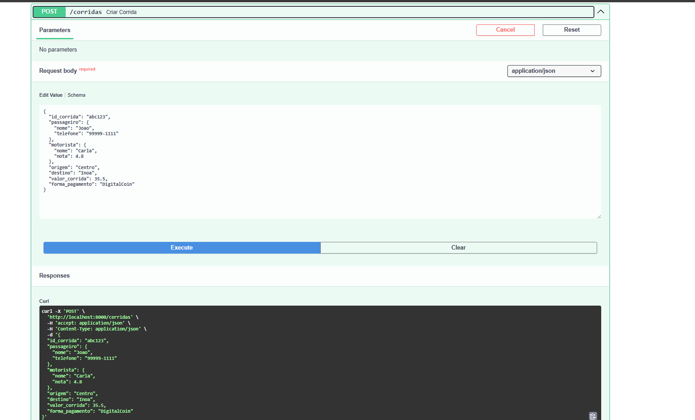
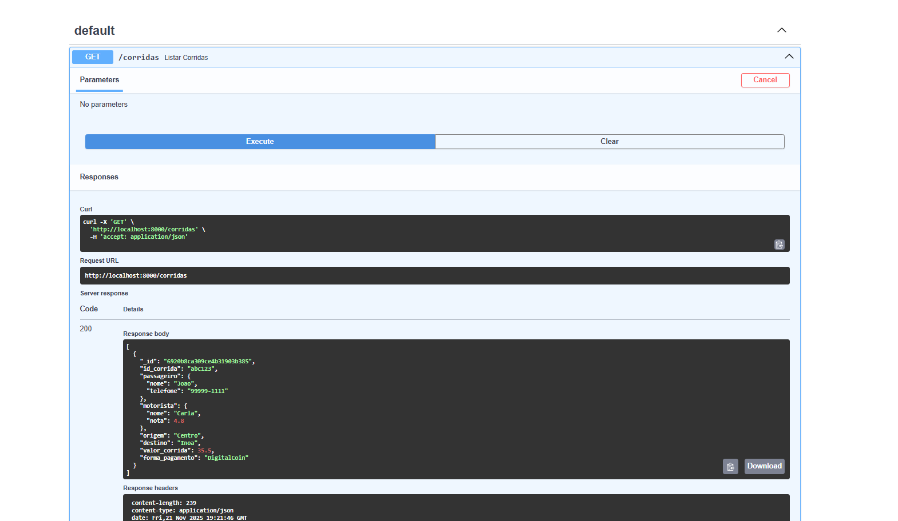
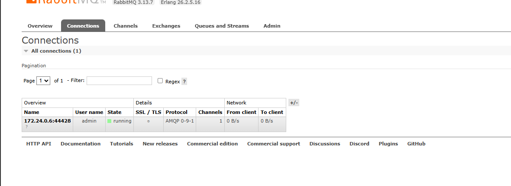

# TransFlow – Processamento Assíncrono

## 1. Passos de Instalação

### Pré-requisitos
- Docker e Docker Compose instalados

### Clonar o repositório
```
git clone <https://github.com/uPolarized/TransFlow_Sistema_de_Corridas_Ass-ncronas.git
cd transflow
```

### Subir a aplicação
```
docker compose up --build
```


## 2. Instruções de Uso

### Documentação da API
Acesse:
```
http://localhost:8000/docs
```

### Criar corrida
Exemplo:
```json
{
  "id_corrida": "abc123",
  "passageiro": { "nome": "Joao", "telefone": "99999-1111" },
  "motorista": { "nome": "Carla", "nota": 4.8 },
  "origem": "Centro",
  "destino": "Inoa",
  "valor_corrida": 35.5,
  "forma_pagamento": "DigitalCoin"
}
```

## 3. Testes

### Ver corridas:
GET /corridas

### Ver saldo:
GET /saldo/carla

### RabbitMQ:
http://localhost:15672  
user: admin  
pass: admin

## 4. Capturas de Tela





